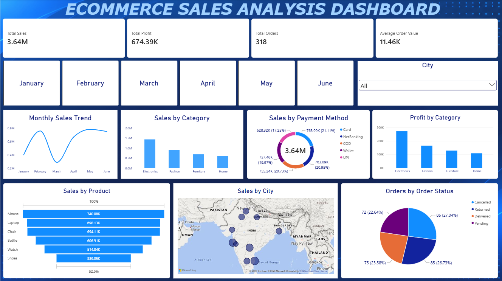

# E-commerce Sales Analysis

This is my Data Analytics project where I worked on an e-commerce sales dataset using Python, SQL, Excel and Power BI.

The main aim of this project was to clean the raw data, analyze the sales performance and create an interactive dashboard to understand the business better.

## Dashboard



## Main KPIs

- Total Sales: 3.64M
- Total Profit: 674.39K
- Total Orders: 318
- Average Order Value: 11.46K

## Tools Used

- Python
- Jupyter Notebook
- SQL
- Excel
- Power BI

## What I Did

- Checked the raw dataset for missing values and duplicates
- Cleaned the data using Python
- Used SQL queries for analysis
- Created DAX measures in Power BI
- Built charts for sales, profit, products, payment methods and order status
- Added Month and City slicers to make the dashboard interactive
- Compared the final KPI values to make sure the dashboard was consistent

## Dashboard Includes

- Monthly Sales Trend
- Sales by Category
- Sales by Payment Method
- Profit by Category
- Sales by Product
- Sales by City
- Orders by Order Status
- Month Filter
- City Filter

## Some Insights

- Electronics has the highest sales and profit among the categories shown.
- Mouse is the highest-selling product in the product chart.
- Card has the highest share among the payment methods.
- Sales change noticeably from month to month.
- The city map helps show where sales are coming from.
- Order status analysis shows cancelled, returned, delivered and pending orders.

## DAX Measures Used

```DAX
Total Sales =
SUM('ecommerce orders'[Sales])
```

```DAX
Average Order Value =
DIVIDE([Total Sales], [Total Orders])
```

I also created measures for Total Profit and Total Orders.

## Project Files

- `Dashboard.png` - Final dashboard screenshot
- `Ecommerce Sales Analysis Project Report.pdf` - Project report
- `Ecommerce Sales Cleaned.csv` - Cleaned dataset
- `Ecommerce Sales Raw.xlsx` - Raw dataset
- `Ecommerce sales.ipynb` - Python/Jupyter Notebook work
- `Ecommerce_Analysis.sql` - SQL queries
- `Ecommerce_Sales_Analysis_Dashboard.pbix` - Power BI dashboard file

## Project Structure

```text
Ecommerce-Sales-Analysis/
│
├── README.md
├── Dashboard.png
├── Ecommerce Sales Analysis Project Report.pdf
├── Ecommerce Sales Cleaned.csv
├── Ecommerce Sales Raw.xlsx
├── Ecommerce sales.ipynb
├── Ecommerce_Analysis.sql
└── Ecommerce_Sales_Analysis_Dashboard.pbix
```

## What I Learned

Through this project, I practiced data cleaning, SQL analysis, DAX measures and Power BI dashboard creation. It also helped me understand how to convert raw data into useful business insights.

